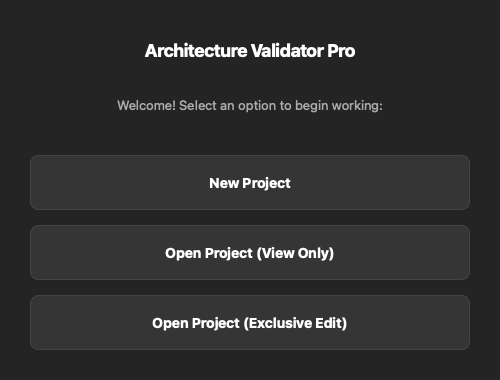

# 1. Getting Started

[← Guide home](README.md) · **Getting Started** · [Next: The Validation Workspace →](02-validation-workspace.md)

---

## Installing & running from source

You'll need Python 3.10+.

```bash
# From the repository root
pip install -r requirements.txt
python src/main.py
```

A pre-built distributable can also be produced with PyInstaller (`ArchitectureValidatorPro.spec` / `build_windows.bat` on Windows) or as a Flatpak on Linux (`flatpak-manifest.yml`). See the main [README](../../README.md#building-a-distributable) for build details.

## The startup launcher

When the app opens, the launcher asks what you want to do:



| Option | What it does |
|--------|--------------|
| **New Project** | Starts a fresh project — you'll pick an ELF binary and a release name. |
| **Open Project (View Only)** | Opens an existing `.arch` project read-only. Safe to use even when a teammate is editing it. |
| **Open Project (Exclusive Edit)** | Opens a project and acquires the edit lock so you can make changes. |

The split between **View Only** and **Exclusive Edit** is the heart of the tool's collaboration model — only one person edits a project at a time, while everyone else can safely browse it. There's more on this in [Collaboration & Safety](06-collaboration-and-safety.md).

## Projects are a single file

A project is one portable `.arch` file (a SQLite database under the hood). It holds everything: your architecture models, every software release and its ELF data, baselines, test case templates, and the change history. Copy it, back it up, or hand it to a colleague as a single file.

## What you'll do next

A typical first session looks like this:

1. **Create a project** and import your first ELF release.
2. **Import your architecture** ports from Excel, CSV, or a Rhapsody export — see [Importing Architecture](03-importing-architecture.md).
3. **Review the matches** the tool proposes between ports and symbols in the [Validation Workspace](02-validation-workspace.md).
4. **Design and generate test cases** from your reviewed data — see [Test Case Design](05-test-case-design.md).

---

[← Guide home](README.md) · [Next: The Validation Workspace →](02-validation-workspace.md)
