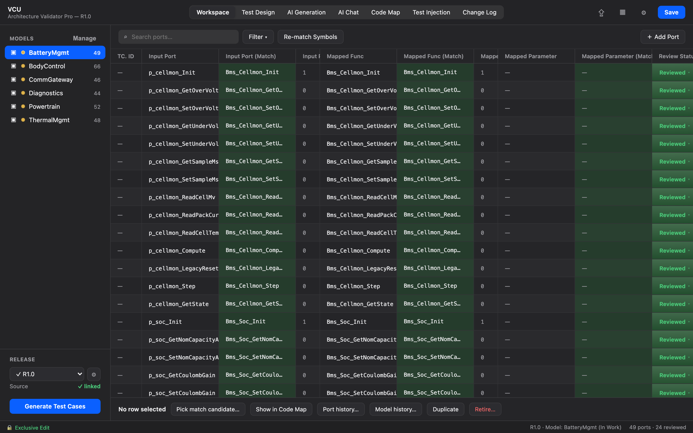

# 2. The Workspace

[← Getting Started](01-getting-started.md) · **The Workspace** · [Next: Importing Architecture →](03-importing-architecture.md)

---

The **Workspace** is the architecture-validation matrix and where most of the work happens. Your ports are laid out as rows, your data as columns, and the left-hand sidebar lists the architecture models and the active release.

> 💡 Want a guided tour? **Preferences → Tutorials → Workspace & architecture matrix** runs through this view interactively.

## Anatomy of the screen

- **The sidebar (left)** — the architecture **models** in the project and the **release** picker. Click a model to load it; the matrix reloads to show it.
- **The scope bar (top)** — a **Search ports…** box, a **Filter ▾** menu, **Re-match Symbols**, and **＋ Add Port**.
- **The matrix (centre)** — one row per port/interface, one column per piece of data you're tracking.
- **The inspector (bottom)** — actions for the selected port: pick a match, show it in the Code Map, view **Port history…** / **Model history…**, duplicate, or retire.
- **The status bar** — the active model and release, total ports, and how many are reviewed.

## Fuzzy symbol matching

When a release's ELF is loaded, search-type columns match each port against the real function and variable names pulled from the binary, using fuzzy string matching with a **configurable confidence threshold**. Each match shows the resolved symbol and a confidence score, colour-coded so a strong match reads green and a weak or missing one reads amber/red. You stay in control: accept the proposed match, pick a different candidate from the match picker, or override it by hand. Click **Re-match Symbols** after importing a new build to re-link every port; cells you've touched by hand aren't silently overwritten.

## Column types

The matrix is fully customizable, and each column has a *type* that defines how it behaves:

| Column type | What it's for |
|-------------|---------------|
| **Port / Function / Variable Search** | Fuzzy-matches the port against symbols of that kind from the ELF |
| **Static Text** | Free-text or read-only data (e.g. a matched symbol name) |
| **Init / Cyclic** | Shows whether a matched function runs at init time and/or cyclically |
| **Review Status** | A drop-down: *Not Reviewed* / *In Review* / *Reviewed* |
| **Port State** | A drop-down: *Released* / *In Work* / *Retired* / *Deleted* |
| **Last Result / Release Result** | Per-release validation outcomes (see [Releases & Baselines](04-releases-and-baselines.md)) |
| **Link** | Cross-references between rows |

Review Status and Port State are colour-coded so the state of every port is readable at a glance — reviewed rows go green, unreviewed rows red, retired ports grey out, and so on.

## Customizing columns

Open the **Columns** toolbar icon to add, remove, reorder, rename, and show/hide columns by drag-and-drop:

A few rules keep things consistent: `TC. ID` always stays first, and once a row has been **Reviewed**, the columns holding its reviewed data are locked so they can't be deleted out from under a sign-off. You can also choose whether *Retired* and *Deleted* ports stay visible (via the **Filter ▾** menu).

## Port states & propagation

Moving a model out of **In Work** doesn't cascade silently. When a model's state changes, a confirmation lists the ports still marked *In Work* and lets you **choose exactly which ones follow** the model's new state — so a state change is always a deliberate act.

## Working with multiple models

A single project can hold several architecture models — for example one per ECU or per software component. The model manager lets you create, rename, duplicate, soft-delete, and restore them:

**Soft-delete** means a removed model isn't gone — it's hidden and can be restored later, so you never lose history by tidying up.

---

[← Getting Started](01-getting-started.md) · [Guide home](README.md) · [Next: Importing Architecture →](03-importing-architecture.md)
