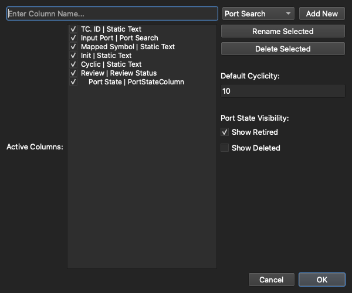
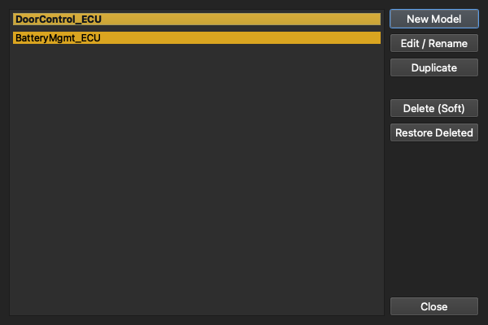

# 2. The Validation Workspace

[← Getting Started](01-getting-started.md) · **The Validation Workspace** · [Next: Importing Architecture →](03-importing-architecture.md)

---

The **Architecture** tab is where most of the work happens. Your ports are laid out as rows, your data as columns, and the right-hand sidebar lists the architecture models in the project.

> 📷 _Screenshot coming soon._

## Anatomy of the screen

- **The table (centre)** — one row per port/interface, one column per piece of data you're tracking.
- **The model sidebar (right)** — switch between architecture models with a click; the table reloads to show that model.
- **The action buttons (bottom right)** — *Generate* test cases, *Select Software Release*, and *Create / Load Baseline*.

## Fuzzy symbol matching

When a release's ELF is loaded, search-type columns match each port against the real function and variable names pulled from the binary, using fuzzy string matching with a **configurable confidence threshold**. You stay in control: accept the proposed match, pick a different candidate, or override it manually. Cells you've touched by hand are tracked so an automated re-match never silently overwrites your decision.

## Column types

The table is fully customizable, and each column has a *type* that defines how it behaves:

| Column type | What it's for |
|-------------|---------------|
| **Port / Function / Variable Search** | Fuzzy-matches the port against symbols of that kind from the ELF |
| **Static Text** | Free-text or read-only data (e.g. a matched symbol name) |
| **Init / Cyclic** | Shows whether a matched function runs at init time and/or cyclically |
| **Review Status** | A drop-down: *Not Reviewed* / *In Review* / *Reviewed* |
| **Port State** | A drop-down: *Released* / *In Work* / *Retired* / *Deleted* |
| **Last Result / Release Result** | Per-release validation outcomes (see [Releases & Baselines](04-releases-and-baselines.md)) |
| **Link** | Cross-references between rows |

Review Status and Port State are colour-coded so the state of every port is readable at a glance — reviewed rows go green, unreviewed rows red, retired ports grey out, and so on.

## Customizing columns

Use the column customizer to add, remove, reorder, rename, and show/hide columns by drag-and-drop:

A few rules keep things consistent: `TC. ID` always stays first, and once a row has been **Reviewed**, the columns holding its reviewed data are locked so they can't be deleted out from under a sign-off. You can also choose whether *Retired* and *Deleted* ports stay visible.

## Working with multiple models

A single project can hold several architecture models — for example one per ECU or per software component. The architecture manager lets you create, rename, duplicate, soft-delete, and restore them:

**Soft-delete** means a removed model isn't gone — it's hidden and can be restored later, so you never lose history by tidying up.

---

[← Getting Started](01-getting-started.md) · [Guide home](README.md) · [Next: Importing Architecture →](03-importing-architecture.md)
