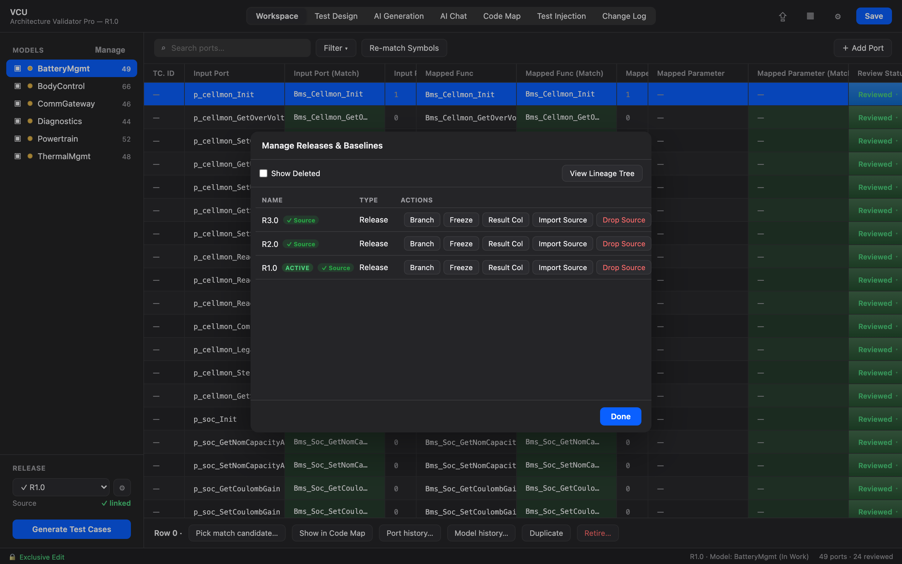

# 4. Releases & Baselines

[← Importing Architecture](03-importing-architecture.md) · **Releases & Baselines** · [Next: Test Design →](05-test-case-design.md)

---

Firmware evolves, and so does the architecture that maps onto it. Releases and baselines are how Architecture Validator Pro keeps validation honest across that change.

## Software releases

A **release** represents one software build, and carries its own ELF binary data and (optionally) its C source. A project can hold many releases at once. Open the **release picker** in the Workspace sidebar, or the full **Release Manager** from the gear next to it:

From here you can:

| Action | What it does |
|--------|--------------|
| **Activate** | Make a release active — the matrix re-matches against that build's symbols |
| **Add release** | Bring in another ELF as a new release |
| **Rename / Delete** | Manage the release list |
| **Map / Import Source** | Attach a C source folder to the release (stored in the project, keyed by release) |
| **Branch** | Create a new editable release from an existing one |
| **Result column** | Add a per-release validation-result column to the matrix |

Only the active release is held in memory, so projects with many large ELF builds stay responsive. Source is imported **once** and stored inside the `.arch` keyed by release — everywhere that used to need a folder picker (Code Map, Change Log, AI) now just reads from a release dropdown.

## Baselines

A **baseline** is an immutable snapshot of a release at a point in time — your reference of record. Creating a new release **auto-baselines** the previous one. A baseline is read-only and **write-protected at the database layer** (not just in the UI); **unfreezing** it requires the project master password, and every freeze/unfreeze is recorded in history. When you're viewing a baseline, a banner makes the read-only state clear and offers a one-click way out.

## Change detection

This is the payoff. **Compare** the active data against a baseline, and changed rows are flagged so a new software release can't quietly drift away from your reviewed architecture without someone signing off.

The per-release **result** columns build on this: each release gets its own column recording whether each port validated — *Pass*, *Block*, *No Result*, or *Not Run* — and the *Last Result* column rolls the latest outcome up so you can see current status without hunting through history. It's an ASPICE-style, single-column verdict an auditor can scan.

---

[← Importing Architecture](03-importing-architecture.md) · [Guide home](README.md) · [Next: Test Design →](05-test-case-design.md)
