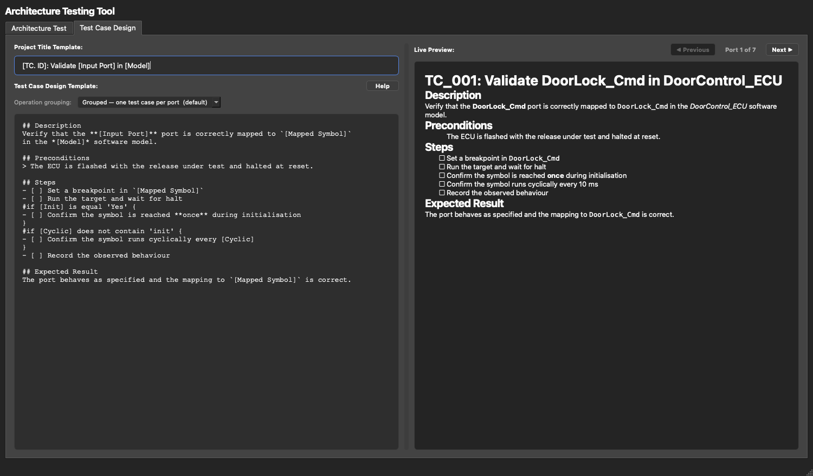
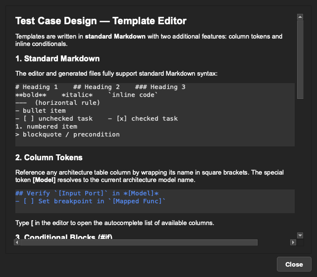

# 5. Test Case Design

[← Releases & Baselines](04-releases-and-baselines.md) · **Test Case Design** · [Next: Collaboration & Safety →](06-collaboration-and-safety.md)

---

Writing low-level test cases by hand, one port at a time, is exactly the kind of repetitive work this tool exists to remove. The **Test Case Design** tab lets you author a template once and generate consistent test cases across every port in your architecture.



The screen is split in two: you write your template on the left, and a **live preview** on the right shows exactly how it renders for a real row from your table — updating as you type.

## The scripting language

Templates are plain **Markdown** with two small additions, so there's almost nothing new to learn. Everything you already know — headings, bold/italic, lists, checkboxes, blockquotes, code spans — just works.

### 1. Column tokens

Wrap any column name in square brackets and it's replaced with that row's value:

```markdown
## Verify `[Input Port]` in *[Model]*
- [ ] Set a breakpoint in `[Mapped Symbol]`
```

The special token `[Model]` resolves to the current architecture model's name. Type `[` in the editor and an **autocomplete** list of your columns pops up.

### 2. Conditional blocks (`#if`)

Show or hide content per row depending on its data:

```markdown
#if [Init] is equal 'Yes' {
- [ ] Confirm the symbol is reached once during initialisation
}
```

Supported operators are `contains`, `does not contain`, `is equal`, and `is not equal` (all case-insensitive). Combine conditions with `AND` / `OR`, and nest blocks as deeply as you like. There's also a `multiple` count predicate for reacting to how many operations a grouped test case represents.

Autocomplete helps here too — after a column token, a space offers operators; after an operator, a space offers values seen in that column.

### Built-in help

A **Help** button in the editor opens a full syntax reference with examples, so the rules are always one click away:



## Operation grouping

The grouping selector controls how rows become test cases:

- **Grouped** — one test case per port, with that port's operations collapsed together (the default).
- **Independent** — one test case per operation.

The live preview respects whichever mode you pick, so what you see is what you'll get.

## Generating & exporting

When you're happy, the **Generate** button produces the test case files. You can export:

- **Individually** — just the current architecture model, or
- **In bulk** — every model in the project at once.

Output is written as Markdown (`.md`) into a *Test Case Design* folder next to your project, ready to drop into your documentation or version control. Retired and Deleted ports are skipped automatically, so generated output only ever covers live ports.

---

[← Releases & Baselines](04-releases-and-baselines.md) · [Guide home](README.md) · [Next: Collaboration & Safety →](06-collaboration-and-safety.md)
