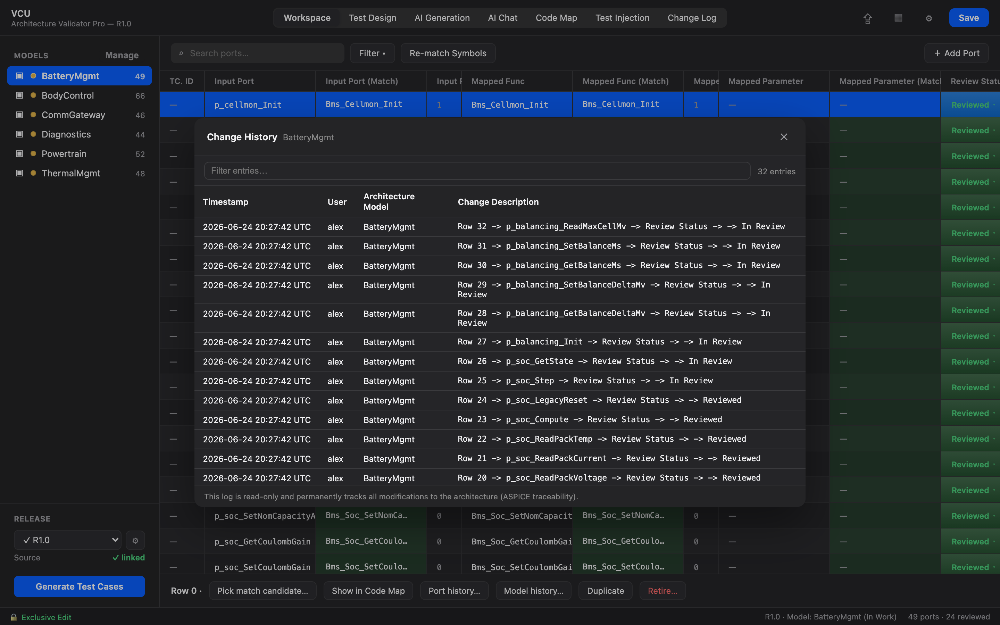

# 6. Collaboration & Safety

[← Test Design](05-test-case-design.md) · **Collaboration & Safety** · [Next: AI Test Generation →](07-ai-test-generation.md)

---

Architecture data is often shared across a team and used for sign-off, so the tool has several features dedicated to not losing work and not stepping on each other.

## Edit modes & file locking

As covered in [Getting Started](01-getting-started.md), a project is opened either **view-only** or **for editing (exclusive)**:

- Opening **for editing** acquires a lock on the project file.
- Anyone else who opens it sees that it's locked and **who holds the lock**, and can still open it view-only to browse safely.
- A banner appears if the lock is lost (e.g. taken by another user) — the session drops to view-only so you can't clobber their work.

View-only isn't just a disabled toolbar: it's enforced **server-side** (the worker opens the database read-only), so a browsing session physically cannot write.

## Saving

Edits are kept in the open project and written to disk when you click **Save** in the title bar (enabled only in an editable session). Because the `.arch` is a single SQLite file with per-block content encryption, saves are fast — there's no decrypt-to-temp / re-encrypt-the-whole-file step.

## Master password & encryption

A project can be protected with a **master password**. The `.arch` is a plaintext SQLite container in which only sensitive content is encrypted, each category under its own key. The master password is required to open an encrypted project and to **unfreeze a baseline**. Legacy whole-file-encrypted projects are migrated to the current format automatically on first open.

## Change history (ASPICE-friendly)

Every modification to the architecture is recorded in a read-only **change log** — what changed, when, who did it, and in which model and release. Open it from the Workspace inspector with **Port history…** (for the selected port) or **Model history…** (for the whole model):

The log is **release-scoped**, obfuscated at rest, and protected by an **append-only HMAC hash-chain**, so edits, deletions, or reordering are detectable. That gives you the traceability process standards like ASPICE expect, without any extra bookkeeping on your part.

---

That's the core tour. The next chapters cover the AI, Code Map, Change Log, and Test Injection views. 🎉

[← Test Design](05-test-case-design.md) · [Next: AI Test Generation →](07-ai-test-generation.md)
