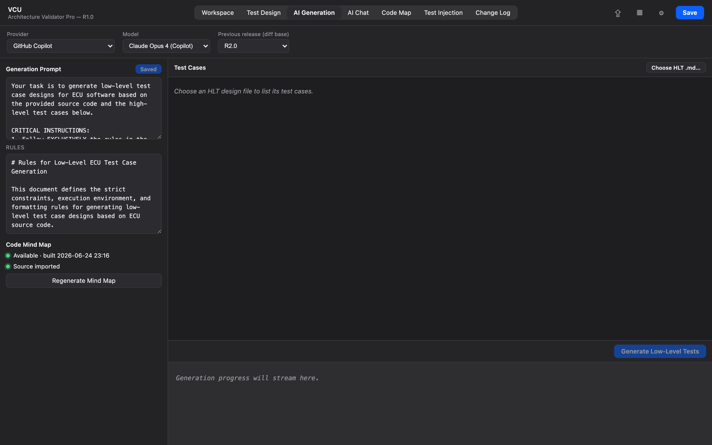

# 7. AI Test Generation

[← Collaboration & Safety](06-collaboration-and-safety.md) · **AI Test Generation** · [Next: AI Chat →](08-advanced-ai-chat.md)

---

The [Test Design](05-test-case-design.md) view produces the *high-level* test cases. The **AI Generation** view takes those a step further: it sends each high-level case, a **code mind map** of your real firmware, and your rules to an AI model, and drafts the detailed **low-level** test code for you — grounded in functions that actually exist.

> 💡 **Preferences → Tutorials → AI test generation** is an interactive walkthrough of the flow below.

## Connecting a provider

AI keys are linked once per machine in **Preferences → AI Settings**. You only need one provider:

| Provider | What you need | Notes |
|---|---|---|
| **GitHub Copilot** | A GitHub account with active Copilot | Device-flow sign-in (authorize a code at github.com/login/device — no manual token). Serves Claude/GPT models *through* Copilot. |
| **Anthropic (Claude)** | An API key from console.anthropic.com | Direct, billed to your account. |
| **OpenAI** | An API key from platform.openai.com | Direct. |
| **Google Gemini** | An API key from aistudio.google.com | Direct. |

> **Where are my keys stored?** Encrypted, on **this computer only**, in a `credentials.aikeys` file in your user config dir — never inside the `.arch` project and never in plain text. Configure once and it works across all your projects. Unconfigured providers are flagged in the view so you don't get stuck.

> **Copilot in a managed company?** Sign-in is account-based, so any Copilot-entitled account should work — but some organizations block third-party OAuth, enforce SSO, or firewall the endpoint. If sign-in fails, that's usually why; use a direct API key as a fallback.

## The layout

A config bar across the top picks the **Provider**, **Model**, and a **diff-base** release. Below it:

- **Left** — the **Generation Prompt** and **Rules** (both saved in the project, so every run is consistent and shared with anyone who opens it), and the **Code Mind Map** section.
- **Right** — the **Test Cases** panel and a streaming **console**.

## The code mind map (grounding)

The mind map is the AI's grounding: a compact, structured index of the release's C source (signatures, call/data-flow relationships, requirement traces). Build it once with **Generate Mind Map** — it indexes the source **locally, with no AI tokens**, and caches it in the project keyed per (model, release). Regenerate after the source changes. Because it's compact, requests stay token-cheap regardless of repo size; raw source is only fetched on demand. The same mind map powers [AI Chat](08-advanced-ai-chat.md) and the [Code Map](09-code-map.md).

## Generating low-level tests

1. Pick a **Provider** and **Model**.
2. Make sure the **Code Mind Map** is built (needs imported source for the release).
3. **Choose an HLT** design file (`.md`) and tick **which test cases** to generate. Cases that already have low-level tests are marked **✓ LL** so you can skip them.
4. *(Optional)* Tune the **Prompt** and **Rules**.
5. Click **Generate Low-Level Tests** — progress streams in the console; the output drops into your project, ready to review and export.

The **Rules** pin down conventions (HiL environment, debugger step paradigms, output format); the **Prompt** sets the task. Both come pre-filled with sensible defaults and can be reset.

---

[← Collaboration & Safety](06-collaboration-and-safety.md) · [Guide home](README.md) · [Next: AI Chat →](08-advanced-ai-chat.md)
