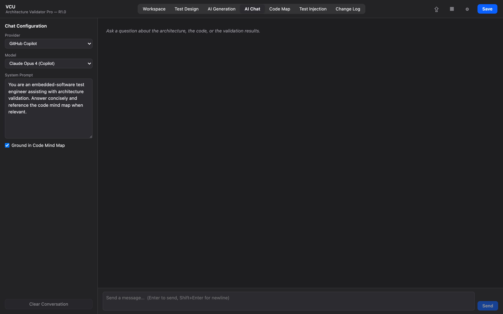

# 8. AI Chat

[← AI Test Generation](07-ai-test-generation.md) · **AI Chat** · [Next: Code Map →](09-code-map.md)

---

The **AI Chat** view lets you ask questions about your firmware and get answers grounded in the *actual* C source — not guesses. When grounded in your **code mind map**, it answers from real functions and files and points at them by name.

> 💡 **Preferences → Tutorials → AI Chat assistant** walks through it interactively.

## What you need

- A connected AI provider (set up in **Preferences → AI Settings** — same providers and credential store as [AI Generation](07-ai-test-generation.md)).
- A **code mind map** for the release you're analysing (built in [AI Generation](07-ai-test-generation.md)).

## The layout

A two-column workspace:

- **Left — configuration:** the **Provider** and **Model** pickers, a **System Prompt** that steers the assistant's role and tone for the whole conversation, and a **Ground in Code Mind Map** toggle. **Clear Conversation** starts fresh.
- **Right — the conversation:** the message thread (rendered markdown, with the agent's tool calls shown inline), a multi-line input, and **Send / Stop**. Press **Enter** to send (Shift+Enter for a newline).

## Grounding & agentic tools

Tick **Ground in Code Mind Map** to give the assistant your indexed source as context. From there it answers using **read-only, sandboxed tools** and shows each call inline, e.g. `→ read_file(adc.c)`:

| Tool | What it does |
|------|--------------|
| `read_file` | Read a source file (sandboxed to the source root) |
| `search_code` | Grep-style search across the source |
| `get_mind_map` | The compact per-model index |
| `get_requirements` | Imported requirements traceability |
| `get_function` / `get_call_graph` | One function's neighbourhood / a caller-callee graph |
| `get_diff` | The stored current-vs-previous diff for a file |

Every tool is read-only and confined to the configured source root by a **path-jail** — the agent can read your code but never write or escape the folder.

**Example:** *"Which functions read the ADC, and is each one validated?"* → the agent reads the relevant files and answers with the exact functions, the symbol each port matched, and its review state. Grounding is what turns it from a generic chatbot into one that knows *your* firmware.

---

[← AI Test Generation](07-ai-test-generation.md) · [Guide home](README.md) · [Next: Code Map →](09-code-map.md)
