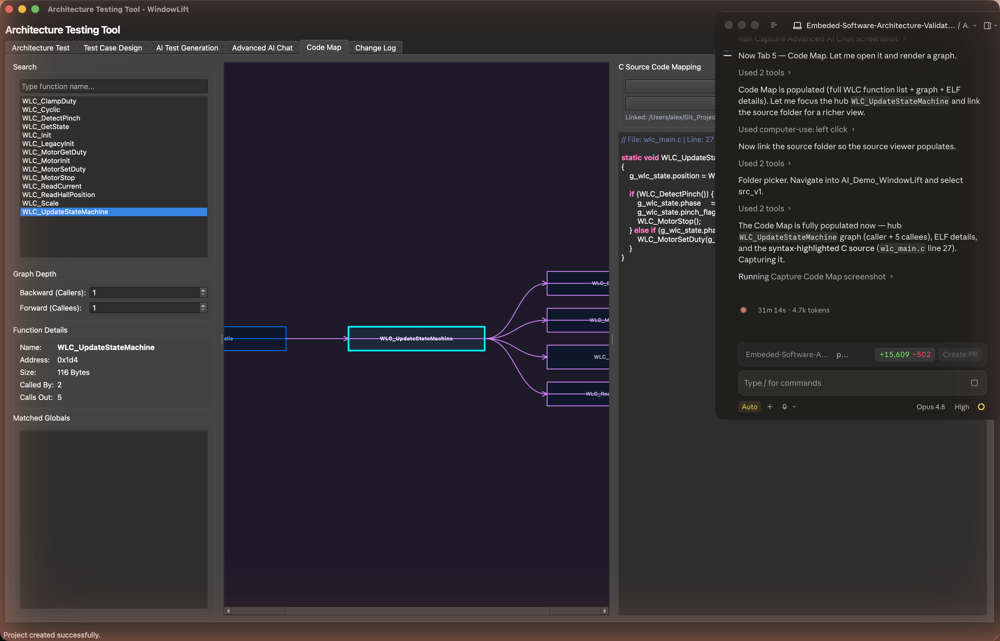

# 9. Code Map

The **Code Map** tab is a visual explorer of your firmware's call graph, joining
what the compiled ELF knows (addresses, sizes, parameters, structs, globals) to
your C source (which file defines each function, the call relationships, the body).

← Back to [8. Advanced AI Chat](08-advanced-ai-chat.md) · Up: [User Guide](README.md)

---

## Where the data comes from

The Code Map is built by joining two sources **by function name**:

- the **ELF / DWARF** facts from the loaded binary (verified addresses, sizes,
  parameter and return types, struct layouts, global types), and
- the **C source index** (which `.c` file defines each function, the caller/callee
  call graph, reads/writes, and the function body for the viewer).

The call-graph *edges* come from the C source (DWARF has no call edges); the ELF
side annotates each node with verified low-level facts. C++ names are demangled
before matching.

## Building / refreshing it

A Code Map is produced when you generate the mind map in
[Advanced AI Chat](08-advanced-ai-chat.md) with an ELF loaded. You can also rebuild
it directly here with **Index & Rebuild Code Map** (under the linked-folder
controls) — this re-indexes the linked source and rebuilds the map **offline, with
no AI tokens**. If no map exists yet for the selected model, the tab shows an
empty-state pointing you to generate one.

## Using the view

- **Search (top)** — filter the function list by substring.
- **Model** — choose which architecture model's Code Map to view.
- **Left column** — the function list, **Callers/Callees depth** spinners, the
  call-graph view, a **Details** panel (signature, ELF address/size/return,
  params, defining file:line), and **Matched Globals** (the node's globals that
  also appear in the ELF).
- **Graph** — forward edges follow `calls`, backward edges follow `called_by`;
  the centre node is highlighted, callers and callees are colour-coded. Double-click
  a node to re-centre on it.
- **Right column** — the mapped C **source** for the focused function, with syntax
  highlighting.

## Large graphs

Hub functions (loggers, error handlers, `memcpy`-style helpers) can fan out to
thousands of nodes. To stay responsive the graph is **capped at 60 nodes** — when a
BFS hits the cap a banner appears (*"Graph truncated — reduce depth or pick a
narrower function"*). Lower the depth spinners or focus a more specific function.

Source is read through the same sandboxed reader as the AI tools, so the viewer can
only read files under the project's source root.

➡️ Next: **[10. Change Log](10-change-log.md)**
