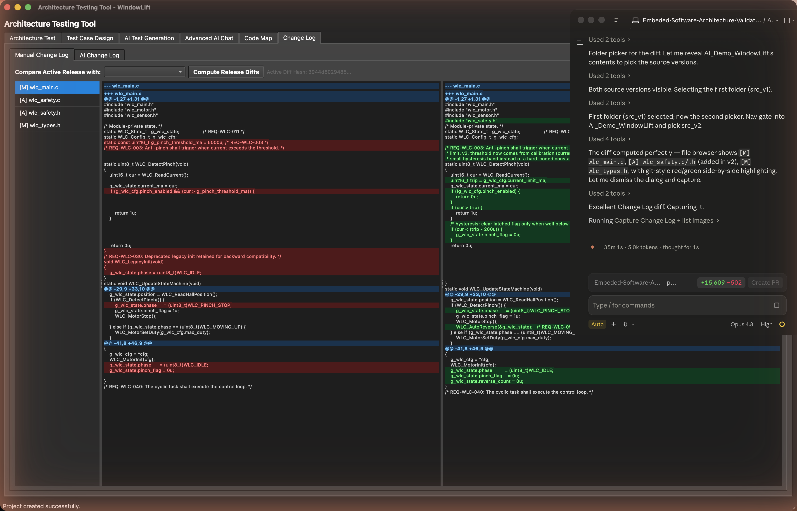

# 10. Change Log

The **Change Log** tab shows what changed in the source between two releases — both
as a precise side-by-side diff and, optionally, as an AI-written summary.

← Back to [9. Code Map](09-code-map.md) · Up: [User Guide](README.md)

---

## Two views

The tab has two sub-tabs:

- **Manual (App-built) Change Log** — a three-column, git-style diff:
  - **Files** — the C/H files that were modified, added, or deleted (from the stored
    release diff for the active model).
  - **Old code** / **New code** — the two versions side by side, reconstructed from
    the stored unified diff, with **synchronized scrolling** and git-style
    highlighting (light red for removed lines, light green for added lines).
- **AI Change Log** — a rendered-markdown summary of the differences, generated by
  the AI on request (requires a connected provider and uses tokens).

## Computing the diff

Click **Compute Release Diffs** (next to the release selector). You'll choose the
**previous** and **current** source folders; the app runs a file-by-file
`difflib`-based comparison, computes a diff hash, and stores the per-file diffs in
the project. The comparison is **stat-gated** — files whose size and timestamp match
in both trees are skipped without being read — so it stays fast and friendly to the
heavy-I/O constraints of locked-down build machines.

Once computed, the diffs are reused by the Manual view here and are also available
to the [Advanced AI Chat](08-advanced-ai-chat.md) agent via its `get_diff` tool, so
you can ask "what changed in this file and why?" and get a grounded answer.

## Typical workflow

1. Baseline a release (see [Releases & Baselines](04-releases-and-baselines.md)).
2. Point **Current** at the new source and **Previous** at the baseline's source.
3. **Compute Release Diffs** → review the side-by-side Manual diff.
4. Optionally **Generate AI Change Log** for a human-readable summary to attach to
   your release record.

⬆️ Back to the **[User Guide index](README.md)**
