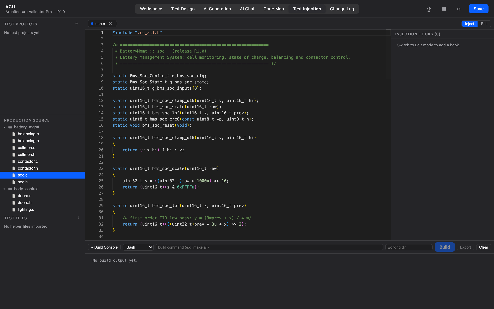

# 11. Test Injection

[← Change Log](10-change-log.md) · **Test Injection** · [Guide home](README.md)

---

The **Test Injection** view lets you splice extra C code — instrumentation, stubs, a test harness — into your firmware **without ever editing the real source files**. Your edits are saved as *hooks* in the project and applied only to generated copies, so your originals stay clean.

> 💡 **Preferences → Tutorials → Test Injection workflow** runs through the whole flow on a simulated screen.

## How it works

A **hook** is a snippet of C anchored to a location in a production source file. Crucially, hooks anchor to the **text of the surrounding lines, not line numbers** — so a hook re-finds its spot even if the upstream source shifts later. Nothing is written to the real file; the hook lives in the project and is applied only when you export.

## The layout

- **Sidebar (left):**
  - **Test Projects** — a container for one set of hooks, helper files, and build settings. Keep several (e.g. a coverage build vs. a unit harness); select one to make it active.
  - **Production Source** — your firmware's real source for the active release (read-only). This is what you inject *into*.
  - **Test Files** — helper `.c/.h` files you import to ride along with the export.
- **Centre:** the source editor with an **Inject / Edit** mode switch, and a **Build Console** with **Build** and **Export**.
- **Right:** the snippet editor for the selected hook.

## The workflow

1. **Create a test project** with **＋** next to *Test Projects*, and select it.
2. **Open a production source file** from the *Production Source* list — it opens in the centre editor in **Inject** mode (a safe preview).
3. **Switch to Edit**, place your cursor where the code should go, and click **＋ Hook at cursor**.
4. **Write the snippet** in the right-hand editor and **Save** — it appears inline in the preview (highlighted green) at the anchor point, while the real file on disk stays untouched.
5. *(Optional)* **Import helper files** (`.c/.h`) under *Test Files* if your injected code calls mocks or a harness. They're kept separate from production code.
6. **Export** and choose how:
   - **Modified** — writes only the files that have hooks.
   - **Reconstruct** — writes the whole source tree with hooks applied.

   Point it at an output folder and you get build-ready code — your originals stay clean.

Because hooks live in the project (not the files), you can tweak or remove them any time and re-export.

---

[← Change Log](10-change-log.md) · [Guide home](README.md)
